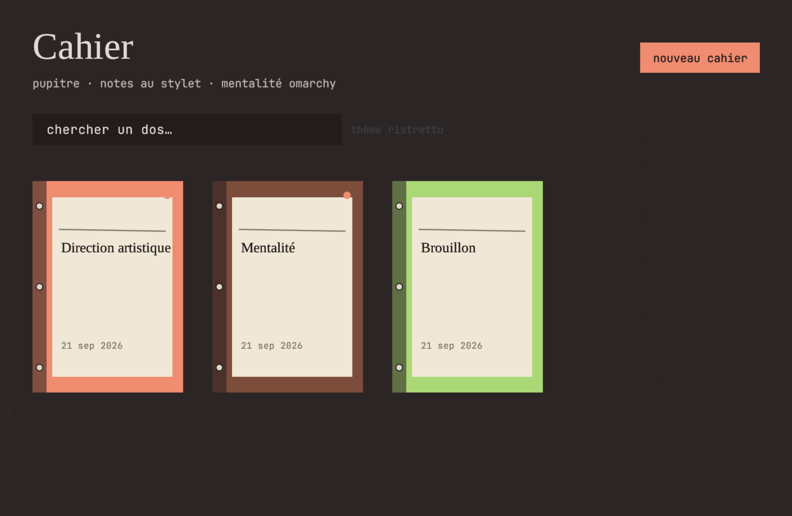
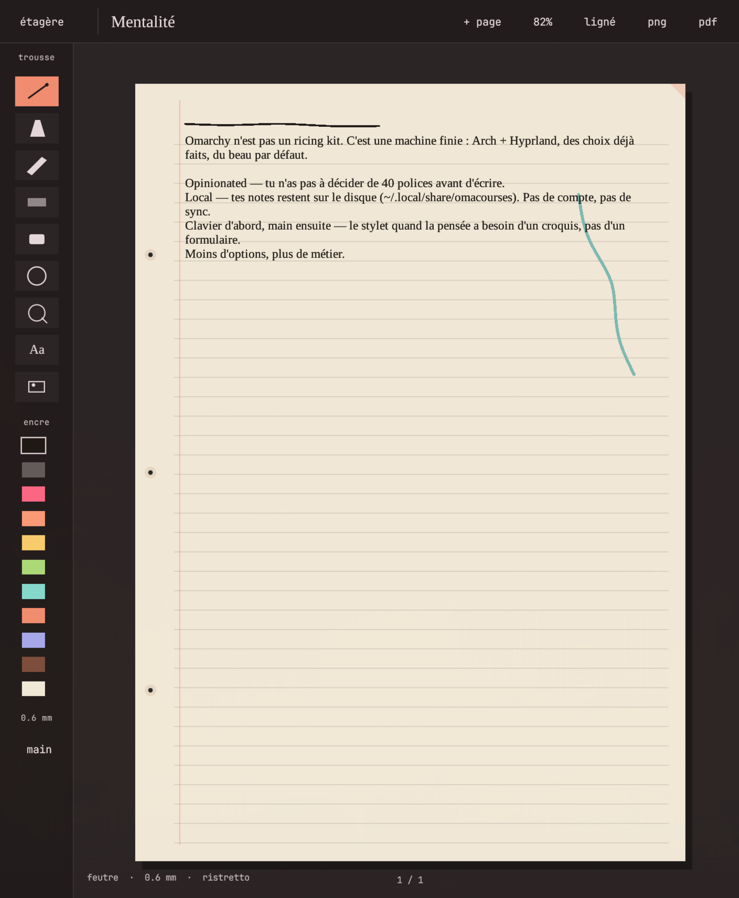
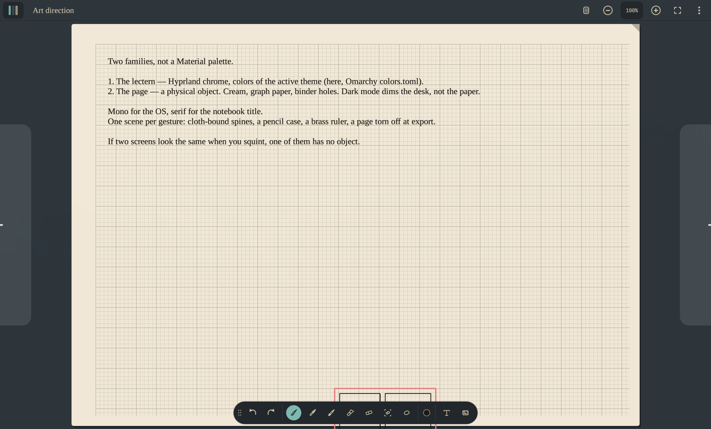

# Cahier

Stylus notes, like Samsung Notes / Apple Notes, sitting on an **Omarchy lectern**.

Two objects: the **shelf** (notebook spines) and the **page** (paper, pencil case, ruler). Chrome follows the active Omarchy theme; paper stays paper.

Local data only — `~/.local/share/omacourses`. No account, no sync.







## Run

```bash
cargo run --release
cahier --help
cahier --data-dir
```

Binary: `cahier`. Data: `~/.local/share/omacourses` (or `$CAHIER_DATA`).

```bash
CAHIER_OPEN=Mentalité cahier   # open a notebook by title
```

Theme read from `omarchy theme current` / `colors.toml`.

## Gestures

| | |
|---|---|
| `p` `b` `c` `h` | felt-tip, fountain pen, pencil, highlighter |
| `e` / `shift+e` | stroke eraser / area eraser |
| `l` `t` `i` | lasso, text, image |
| `[` `]` `1-9` | thickness, ink |
| `m` | cycle paper (blank, lined, grid, dotted, graph, slate) |
| space + drag, two fingers | pan |
| `+` `−` · buttons · pinch · two fingers on trackpad · ctrl + scroll | zoom |
| corners / `0` / click on % | fit to screen |
| right-click | eraser |
| shift while releasing a stroke | line / circle / rectangle |
| `ctrl+z` `ctrl+e` `ctrl+shift+e` | undo, PNG, PDF |

Stylus: pressure via touch events if the compositor sends them; otherwise the fountain pen simulates pressure from speed. **Stylus** mode in the pencil case ignores the palm.

First launch: notebooks *Mentalité* and *Direction artistique*.
