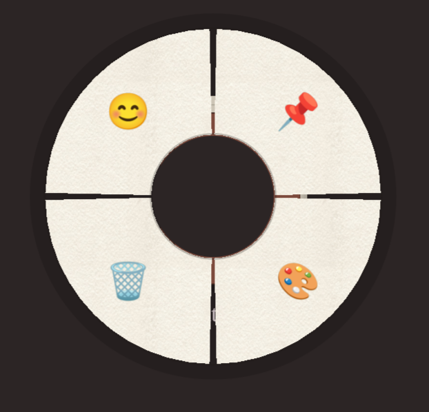
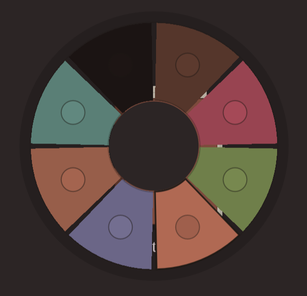
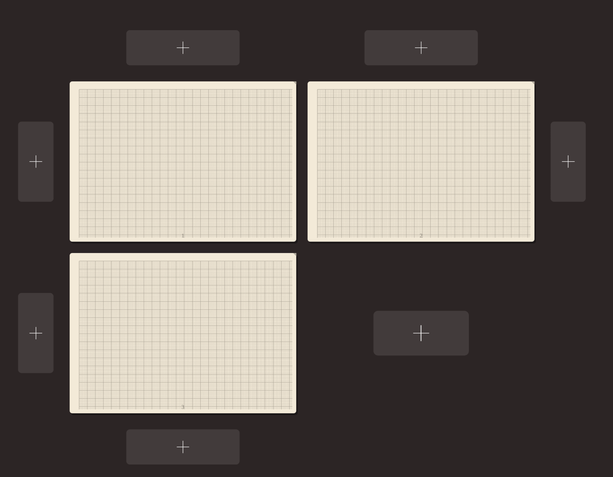
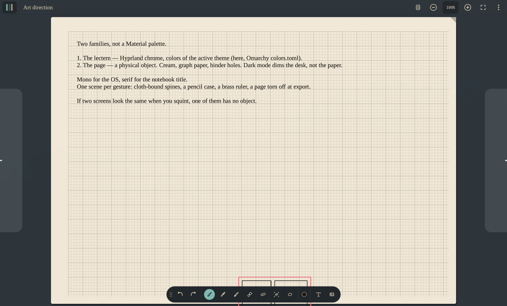
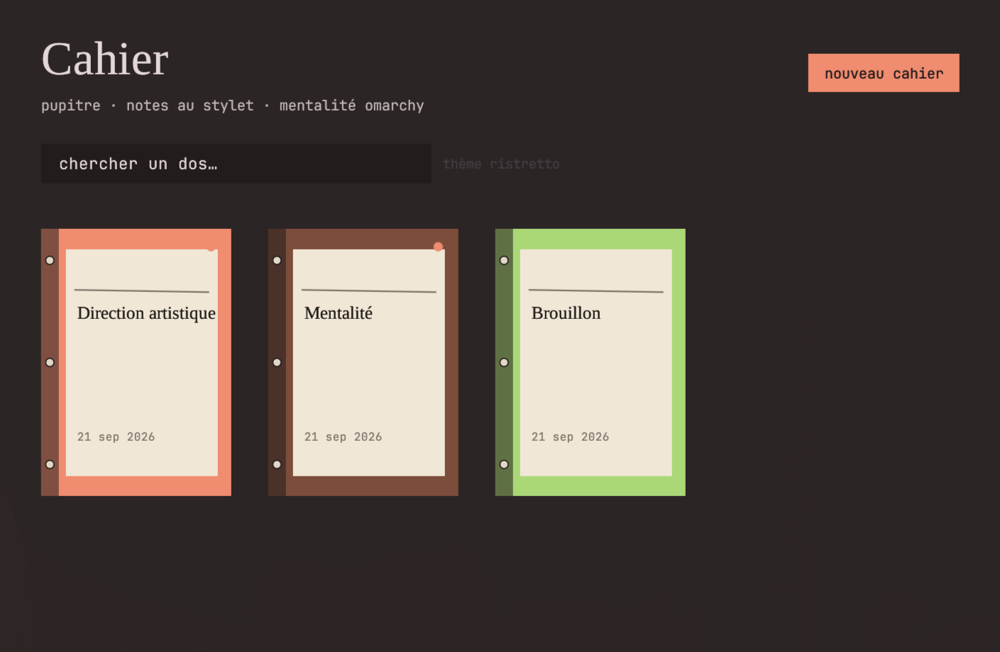
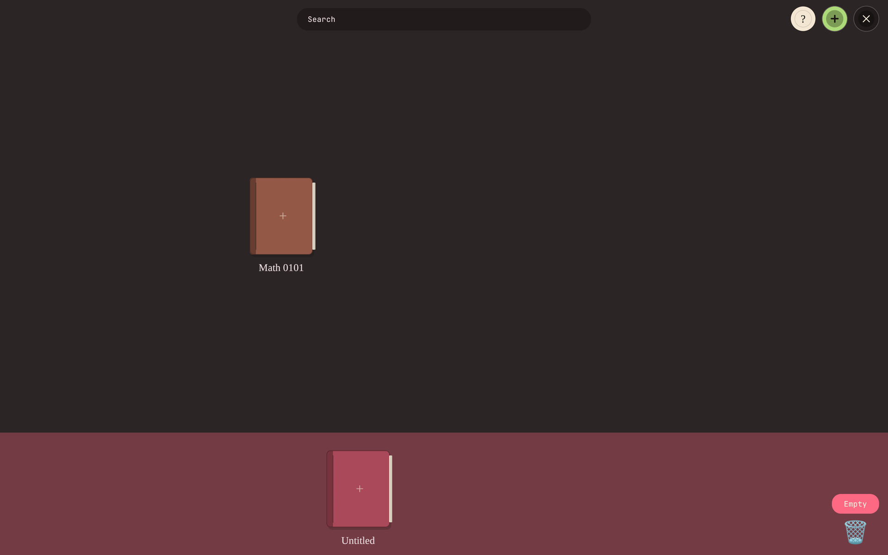
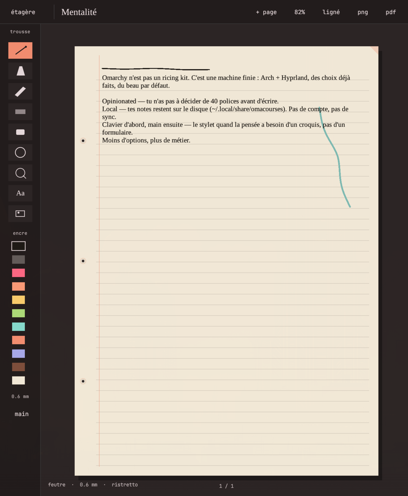

# Cahier

Stylus notes on an **Omarchy lectern**. Cahier is a native Rust and egui app for handwritten notes, sketches, and diagrams.

The **shelf** holds your notebooks; each notebook opens onto a page with paper, drawing tools, and a ruler. The interface follows the active Omarchy theme, while the paper keeps its own look.

Your notes stay on your computer in `~/.local/share/omacourses`. Cahier needs no account or network connection.

## Nouveautés

### Plusieurs pages, deux façons de les lire

Ajoutez des pages autour de la feuille. Affichez-les bord à bord en mode *Linked*, ou gardez un espace entre elles en mode *Separate*.

<p align="center">
  
  
</p>

Les onglets `+` ajoutent une page sur un bord libre.

<p align="center">
  
</p>

### Du papier pour chaque idée

Choisissez une feuille lignée, quadrillée, pointillée, millimétrée ou vierge. Le papier Canson apporte un grain discret aux notes et aux croquis.

<p align="center">
  
</p>

### Une étagère et une corbeille

Retrouvez vos carnets sur l’étagère et restaurez ceux placés dans la corbeille.

<p align="center">
  
  
</p>

## Aperçu



## Run

### Install (Arch Linux / Omarchy)

```bash
curl -fsSL https://raw.githubusercontent.com/CloudDown/omacourses/main/install.sh | bash
```

The installer checks the Arch build dependencies, asks before installing any that are missing, builds the latest version from source, and puts `cahier` in `~/.local/bin`. It also supports other Linux distributions if Rust/Cargo and the required graphics development libraries are already installed.

```bash
cargo run --release
cahier --help
cahier --data-dir
```

Binary: `cahier`. Data: `~/.local/share/omacourses` (or `$CAHIER_DATA`).

```bash
CAHIER_OPEN=Mindset cahier   # open a notebook by title
```

Theme read from `omarchy theme current` / `colors.toml`.

## Gestures

The lectern follows the stylus: in range, the hand pans and the nib writes. Put it down, the mouse writes again.

| | Mouse | Stylus in range |
|---|---|---|
| Writes | mouse | stylus |
| Pan | space + drag, middle-click, trackpad | finger, two-finger drag |
| Eraser | right-click hold (last kind), `e` / `shift+e` | stylus button hold, air-click to toggle |
| Undo | `ctrl+z` | two-finger tap |
| Zoom | pinch, two-finger trackpad, `+` `−` | pinch |

| | |
|---|---|
| `p` `b` `c` `h` | felt-tip, fountain pen, pencil, highlighter |
| `e` / `shift+e` | stroke (whole stroke) / area (under cursor) |
| `l` `t` `i` | lasso, text, image |
| `[` `]` `1-9` | thickness, ink |
| `m` | cycle paper (blank, lined, grid, dotted, graph, slate) |
| corners / `0` / click on % | fit to screen |
| hold the pen still ~1s | line / arrow / triangle / square / diamond / ellipse / circle |
| `ctrl+s` | save |
| `ctrl+e` `ctrl+shift+e` | PNG, PDF |

### Shelf

| | |
|---|---|
| Right-click a spine (or hold a finger) | spine wheel — pin, color, trash, mark |
| Wastebasket | open / close the bin row |
| Drag onto the bin (or a bin cell) | trash the notebook |
| Drag out of the bin | restore to the shelf |
| Two-finger drag on the shelf | scroll |

### Pages

| | |
|---|---|
| `+` on a free edge | add a unit page there |
| Fold corner (when more than one unit) | tear that unit off |
| ⋯ → Linked / Separate | flush sheet vs gutter between pages |

First launch: notebooks *Mindset* and *Art direction*.
